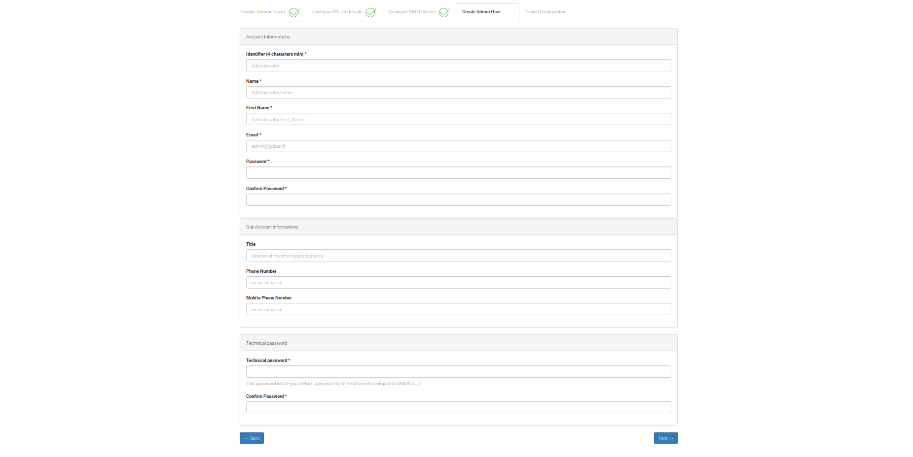
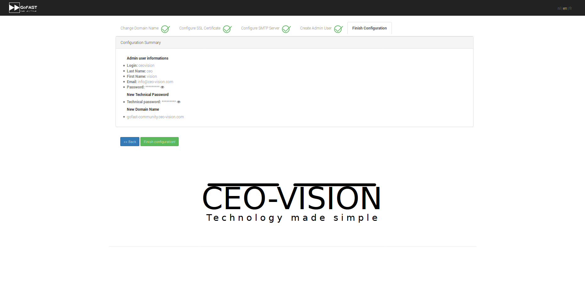

********************************************
GoFAST Community :  Installation
********************************************

.. note:: If you have problems, you can ask some help on our Community forums:  https://community.ceo-vision.com

.. caution:: Don't forget to check that updates are available (your environment must have internet access) 


Instructions (for AWS Marketplace)
------------
https://aws.amazon.com/marketplace/pp/B07NPZHPG3

.. caution:: Don't forget to choose ``default`` "Security Group" to allow 22 (ssh) and 443 (https) inbound trafic

Instantiate GoFAST then go to the `Configuration`_ section


Instructions (from image)
------------

–Step 1: Download the image https://www.ceo-vision.com/en/content/gofast-community-ged-plateforme-collaborative-opensource (.ova, ...)

–Step 2: Start the instance on your VirtualMachine (VMWare, HyperV, ...)

–Step 3: Assign an IP address on the Virtual Machine: 

 For you information ``login : root`` ``password : @C0mmunity!`` (with a 0 not O)

.. WARNING:: 
   Change immediately your root password 

–Step 4: Enter ``https://your_ip_address`` and configure the platform

-Step 5: To access the platform via an FQDN, please configure your DNS or /etc/hosts file

Configuration
-------------

.. figure:: img/Logo-Community.png
   :alt: 

For all informations about pre-requisites please check this page (French for now) : https://gofast-docs.readthedocs.io/fr/latest/docs-gofast-technical/gofast-docs-prerequis-installation-serveur.html#gofast-pre-requis-et-installation-serveur

.. note:: To configure your GoFAST Community instance, please enter the IP address of the GoFAST server. 
          Example : https://35.180.66.5

5 steps are required to finish the GoFAST Community configuration : 

* Change name domaine
* Configure SSL Certificate
* Configure SMTP Server
* Create Admin User
* Finish Configuration 

You will find below detailed configuration for every steps and what is the purpose of every fields requiered.

Step 1 : Define Domain Name
`````````````

Configuration screen looks like: 

.. figure:: img/gf-community-define-domain-name.png 

On this screen you will describe every part of the FQDN of GoFAST, ex. ``gofast.ceo-vision.com`` : 

   1. **New Sub-Domain** : This is the subdomain of the GoFAST, ex. ``gofast``
   2. **New Domain** : This is usualy the domain of your organisation ex. ``ceo-vision`` 
   3. **New extension** : This is the TLD, the last part of the url ex. ``com`` 


Step 2 : Configure SSL Certificate 
`````````````

At this step you will have 2 configuraiton possibilities.

.. figure:: img/gf-community-import-certificate.png 
   :alt: import certificate

The first option (recommended) is to upload your own SSL certificates 
  - **Key Private** :
  - **Key Public** :

The second option gives you the ability to create a self signed certificate. 
Several mandatory fields will be requested :

.. figure:: img/gf-community-create-self-signed-certificate.png
   
      
   1. **Country**
   2. **State or Province**
   3. **City**
   4. **Company** 
   5. **Organization unit** 
   6. **Web site name**
   7. **E-mail address** 


Step 3 : Configure SMTP Server 
`````````````

This third step will help you to configure the SMTP server used by GoFAST: 

.. figure:: img/gf-community-smtp-config.png
   :alt:
 
   
The different fields requested : 

   1. **SMTP Server** :  
   2. **Username** : 
   3. **Password** : 
   4. **Security** : None (without security), TLS (....), SSL (....)
   5. **SMTP Port** : 
   6. **Recipient address** : 


Step 4 : Create Admin User
`````````````

This step will define the 'administrator' account who will have access to several configurations once the GoFAST instance is started

You will have to choose a login, password and email address linked to this 'admin' account 


   

Step 5 : Finish Configuration 
`````````````

This last step is a summary of all informations entered in the previous steps for your GoFAST Community

.. WARNING :: 
   After clicking on "Finish Configuration" you will not be able to come back to the previous steps, 
   please check every fields before submitting 


   

Get Started ! 
-------------

You will need to create some users and collaboratives spaces (and sub spaces).

Spaces can be from different types, "Organization" (departements, ...), "Groups" (projects, ...), "Extranet" (partners, customers, ...)

In those spaces add the users that can have access to the content in this space. Add subspaces if needed.

Add content using drap&drop in the GoFAST File Browser.

You are ready to start !
